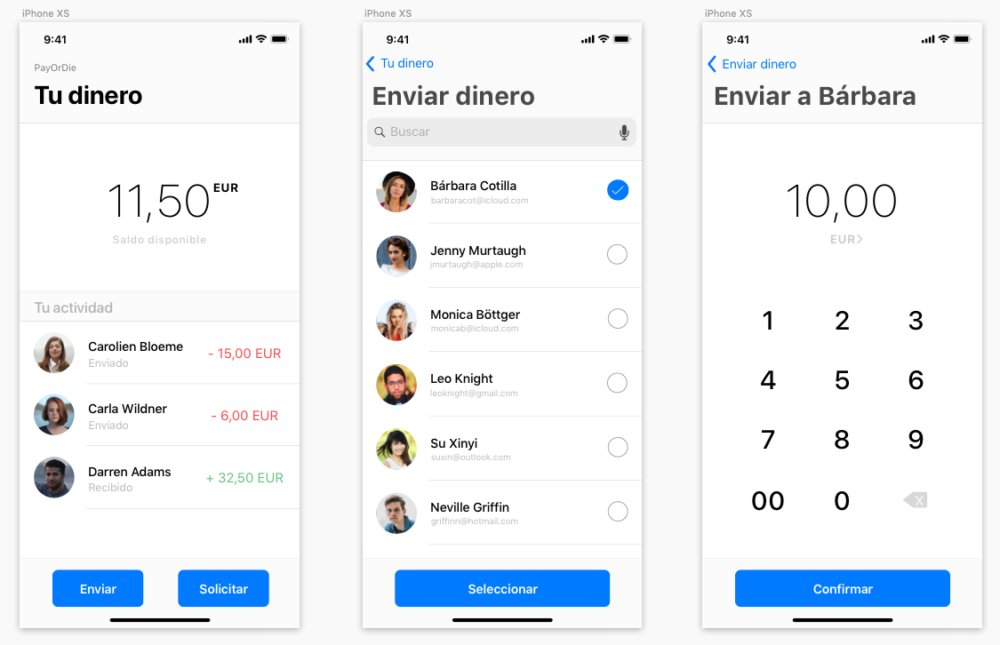

# PayOrDie
Práctica Diseño para Devs Boot 7 (2018)

**Explica las decisiones más importantes que has tomado y que consideres más importantes.**

La decisión más importante ha sido elegir el flujo de la aplicación y la información a mostrar en cada una de las 3 pantallas. En primero lugar, he decidido mostrar la cantidad de dinero que tiene el usuario, los últimos movimientos realizados y los botones de enviar y solicitar el dinero. A continuación, mostrar una lista de contactos, dando la opción de poder seleccionar mediante checkbox tantos contactos como desee el usuario. Y en último lugar, una vez que el usuario sabe que acción y sobre que contacto/s la va a realizar, escoger el importe deseado para finalizar el proceso.

**Desde el punto de vista humano, ¿qué cuestiones crees que son clave?**

Me he basado en un diseño sencillo y familiar de iOS, para hacer sentir comodo al usuario en todo momento y que tenga claras las acciones que puede realizar en cada pantalla. Además, he usado como color principal el color azul para dar más seguridad al usuario, usando solamente el color rojo y verde para indicar de manera más visual en el apartado de actividad si se trata de un dinero enviado o recibido.

**¿Qué onboarding crees que sería el adecuado?**

Sería adecuado indicar al usuario la necesidad de asociar una cuenta bancaria o similar a la cuenta de PayOrDie para poder empezar a usar la app, así como la manera de añadir contactos a la app para poder enviar o solicitar dinero. Una vez aclaradas estas dos cuestiones, ya estaria todo preparado para poder usar la app sin problemas.
